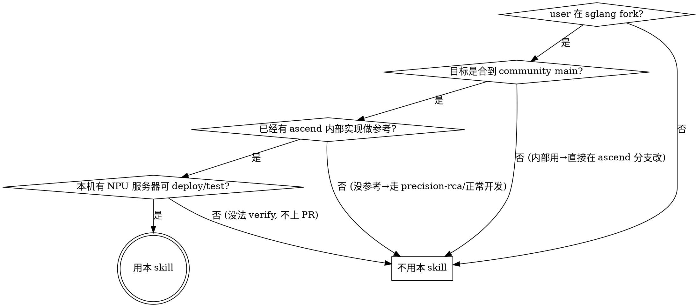

# SGLang — Ascend NPU port onto community `main`

把一个**已经在某个 ascend 上游 fork 跑通的模型适配**搬到 `sgl-project/sglang`
主分支,然后以社区可接受的形态提 PR。

本 skill 描述 NPU port + 提 PR 一整个闭环的工作流: 从 branch 拓扑到 deploy 测试
到 commit 布局,并附 reference 文件汇总常见 trap 与 debug 原则。

## 0. 先把变量定下来

每次启动这个 skill,先跟用户对齐这四个变量,后面所有命令都用它们代入:

| 变量              | 含义                                  | 例子                                                       |
|-------------------|---------------------------------------|------------------------------------------------------------|
| `$ASCEND_REMOTE`  | ascend 上游 fork 的 git remote 名     | `<some-fork>` / `<author>-ascend`                          |
| `$ASCEND_BRANCH`  | 该 fork 上跑通的分支                  | `<arch>_release` / `npu_<arch>`                            |
| `$MODEL`          | 目标模型代号(用于 commit / env flag)  | `<Model-Name>` (slug: `<model-slug>`)                      |
| `$YOUR_FORK`      | 你自己 fork 的 git remote 名          | `fork`                                                     |

如果用户没说清楚,**先问一次,不要默认**。剩余文档里出现 `$X` 的地方就照单替换。

## 1. 决策树:这单活儿该不该用这个 skill



## 2. 在动手之前:把 remote topology 摆好

社区 ascend port 的 git 拓扑是**三个 remote**。先 `git remote -v` 看是不是这个布局,
缺哪个补哪个:

| Remote            | 来源                                              | 作用                          |
|-------------------|---------------------------------------------------|-------------------------------|
| `origin`          | `git@github.com:sgl-project/sglang.git`           | 社区 main, **最终目标**       |
| `$YOUR_FORK`      | 你的 fork                                         | 提 PR 的源                    |
| `$ASCEND_REMOTE`  | ascend reference fork                             | **拷代码用**                  |

```bash
git remote add origin           git@github.com:sgl-project/sglang.git  || git fetch origin
git remote add $YOUR_FORK       git@github.com:<your-user>/sglang.git  || git fetch $YOUR_FORK
git remote add $ASCEND_REMOTE   <ascend-fork-url>                       || git fetch $ASCEND_REMOTE
```

工作分支按下面这套**五件套**展开,任何时候 `git branch | head` 都应该能看到这五条:

| 分支                                     | 来源                                | 含义                          |
|------------------------------------------|-------------------------------------|-------------------------------|
| `main`                                   | `origin/main`                       | 社区 baseline                 |
| `feat/<slug>-ascend-npu`                 | 基于 ascend reference 的老分支      | (历史) ascend-base 的 port    |
| `feat/<slug>-ascend-npu-on-main`         | rebase 到 `origin/main`             | **真正开发**的分支, port-on-main |
| `pr/<slug>-npu`                          | squash 出来的单 commit              | **要给社区看的 PR 内容**      |
| `pr/<slug>-npu-review-fix`               | PR + review-fix overlay             | reviewer 改完之后的 PR        |

`<slug>` 是 `$MODEL` 的短代号 (e.g. `dsv4-flash`, `qwen3-next`)。后两条是 PR 阶段才造,见 §6。

## 3. 选择策略:**port-on-main, 而不是 rebase upstream**

新人很容易选错的一步。两条路:

| 选项                                                              | 结果                                                  |
|-------------------------------------------------------------------|-------------------------------------------------------|
| (a) `git rebase main $ASCEND_REMOTE/$ASCEND_BRANCH`               | 几千行冲突, ascend 的抽象 (KV pool / backend mixin) 跟 main 不是同一个, 大段重写 |
| (b) **port-on-main: 在 main 上加薄薄一层 NPU 分支**                | ✅ 走这条                                              |

**Why:** ascend fork 上的某些子系统(典型如自定义的 `Compressor` / `nn.Module`、
direct KV-pool 写 / 私有 metadata builder)通常跟 main 的"backend mixin + 通用
kernel chain"是不同抽象,不可能 wholesale 拷过来,只能挑出 op 调用 + buffer
layout,**在 main 的 file 里加 `if _is_npu:` 分支**。

**How to apply 一个文件:**

```python
# main 原代码 (CUDA)
def forward(self, x, fb):
    return self.backend.forward_compress(x, fb)  # 原 kernel chain

# port-on-main 后
def forward(self, x, fb):
    if _is_npu:
        return self._forward_npu(x, fb)          # 新加, 调 torch.ops.custom.*
    return self.backend.forward_compress(x, fb)  # 原路径不动

def _forward_npu(self, x, fb):
    # 这里照抄 git show $ASCEND_REMOTE/$ASCEND_BRANCH:<file> 的同一函数
    ...
```

**绝对不要做的事:**

- 不要为了"统一接口"把 CUDA 路径也改掉。reviewer 看 PR diff 时,**CUDA 行为字面不变**是过 review 的第一关。
- 不要在 NPU 分支里塞 torch fallback,除非两边都没现成 NPU op。
  `git show $ASCEND_REMOTE/$ASCEND_BRANCH:...` 第一,`torch.ops.custom.*` /
  `torch_npu.*` / `sgl_kernel_npu.*` 第二,torch fallback 最后。详见
  `references/npu_op_priority.md`。

## 4. 一个 file 的 port 五步法

对每一个要 port 的文件,机械地走这五步:

### 4.1 拉 reference

```bash
git show $ASCEND_REMOTE/$ASCEND_BRANCH:python/sglang/srt/<path> > /tmp/ref.py
git show origin/main:python/sglang/srt/<path>                    > /tmp/main.py
diff -u /tmp/main.py /tmp/ref.py | less
```

读 diff,认清:**main 走什么算子链 vs ascend 走什么 NPU op**。

### 4.2 在 main 文件里加 `_is_npu` 分支

```python
from sglang.srt.utils import is_npu
_is_npu = is_npu()
```

每个 callsite **保留 main 原路径不变**,新增 `if _is_npu:` 走 NPU op。如果
NPU op 签名跟 main 数据流不一致(例如 main 喂 `freqs_cis: complex`,ascend 喂
`cos/sin: 2 个 real`),**在 NPU 分支内做最小桥接转换**,不要回传到 main 分支。

### 4.3 op 来源(优先级见 references)

参见 `references/npu_op_priority.md`。简表:

1. `git show $ASCEND_REMOTE/$ASCEND_BRANCH:<file>` —— **同函数的 ascend 实现**, 这是 ground truth
2. `torch.ops.custom.*` —— `custom_ops` 包 (CANN 镜像内置)。**是 lazy namespace**,首次访问前必须 `import custom_ops`。
3. `torch_npu.*` —— Ascend 官方 op
4. `sgl_kernel_npu.*` —— sglang-npu 自家 fused kernel
5. torch fallback —— 最后手段,需在 docstring 写清楚为什么没用 NPU op

### 4.4 把通用 trap 清单过一遍

参见 `references/common_npu_traps.md`。clean-up 完每个文件之后, 对照这个表自检:

- `torch.ops.custom.<op>` lazy namespace —— `import custom_ops` 了吗
- main 上 forward_metadata 的某些字段为 None —— 你需要的字段是不是被 main 填了
- model_config 里某些 head_dim 字段对你的模型不适用 —— 你用了模型实际的 head_dim 吗
- NPU 不支持 fp8/fp4 —— low-precision 路径 gate 了 `_is_npu` 吗
- KV pool buffer collision —— layer 索引用 raw layer_id 而不是某个子集 counter
- sparse index 用 `-1 sentinel` —— **不能用**,NPU kernel 读成 uint 越界
- compressed-KV vs full-KV page_size 不匹配 —— pool 用 `page_size // ratio` 还是 global `page_size`?

### 4.5 commit, 一个文件一个 commit

```
fix(<slug>): port ascend Compressor class for $MODEL schema
fix(<slug>): make <some-cuda-only-import> optional in <file>
fix(<slug>): map <new-cli-arg> argparse dest to <field>
```

(commit 命名 style: `fix(<slug>): <verb> <noun>`。review-fix 阶段用
`fix(npu): ...`,见 §6。)

## 5. Deploy + smoke test loop

主要心智模型:**本地写 → 一键 deploy 到 NPU 机 → curl /generate → 看是不是 200**。
PR 不接受没有过 `/generate` 200 OK 的代码。

### 5.1 启动前先 probe NPU dies

共享 NPU 服务器,**绝对不要 `pkill -f` 别人的进程**。流程:

```python
# 探测空闲 die — 见 scripts/probe_npu_dies.py
ssh root@<npu-host> "npu-smi info | grep -A40 'Process id' | head -50"
ssh root@<npu-host> "ss -tnlp 2>/dev/null | grep -E ':3010[0-9]' || echo no servers"
```

要 N 个 die 启动,空闲不够就**指数回避**: 60s → 120s → 240s → ... → 1800s 上限,
不要无脑 retry 也不要等用户介入。

### 5.2 把改动 deploy 到 NPU host

两种方式按场景挑:

**方式 A — git pull(推荐, 用于 PR-shaped 分支):**

```python
# scripts/deploy_via_git_pull.py
ssh root@<npu-host> "
  cd <remote-worktree> &&
  git fetch $YOUR_FORK pr/<slug>-npu-review-fix &&
  git checkout pr/<slug>-npu-review-fix &&
  git reset --hard $YOUR_FORK/pr/<slug>-npu-review-fix
"
```

适合: 已经 push 到 fork、要给 reviewer 复现的状态。

**方式 B — SFTP tarball(用于本地 WIP 还没 push):**

```python
# scripts/deploy_via_sftp.py — 见 scripts/
# 1. tar + gz 你 touch 过的 N 个 PR 文件
# 2. paramiko SFTP 上传到 <remote-worktree>/../pr_test.tar.gz
# 3. 解压覆盖 <remote-worktree>/
# 4. grep 验证关键改动是否落地 (SENTINEL 字符串自己设)
```

适合: 改 1-2 个文件想立刻 retry,不想 commit-push-pull 三步。**用完即弃**,
不要把 tarball 放进 git。

### 5.3 launch.sh 的纪律: **只改 8 行**

NPU env 极度敏感, 缺一个 `source set_env.sh` 直接走错代码分支。**永远基于
原 .sh 改, 不"自己挑必要的"**。原 .sh 在哪每台机不一样, 问用户要 path 或者
`ls /home/<user>/*.sh`。详见 `references/env_strict_launch.md`。可以改的 8 行:

1. `MODEL_PATH=...`
2. `--tp-size N --dp-size N`
3. `ASCEND_RT_VISIBLE_DEVICES=...`
4. `PYTHONPATH=<remote-worktree>/python:$PYTHONPATH`
5. `--port <free-port>`
6. `--quantization <method>` (仅当原 .sh 用的 quantization 跟当前 ckpt 不匹配时)
7. PID 文件 + cleanup 守卫
8. log 重定向

**其它 env / source / sysctl 一律照抄不省。**

### 5.4 curl smoke

参见 `scripts/launch_and_smoke.py`:

```python
# 1. 启动 server (docker exec -d, nohup, > log)
# 2. poll /get_model_info 直到 "model_path" in response
# 3. /generate 一个固定 prompt 看输出是否可读 (不能是乱码)
# 4. 至少看到完整中文/英文 token, 不能是乱码
```

最早 2 个 token 的对齐(跟 $ASCEND_REMOTE 同一 ckpt + prompt)就足以发现 buffer
collision 之类的低层 bug,**不用等跑 GSM8K / MMLU**。完整 accuracy 跑留给 PR 描述
里的最终 metric。

## 6. Debug methodology: dumps > code diff

详见 `references/debug_methodology.md`。要点:

### 6.1 看到 ascend 跟 main 字面不同, **不等于**找到了 bug

典型反例: `unsqueeze(1)` vs `unsqueeze(-2)` 的 shape 看似不同, 但 broadcast 到
同样的 (T, 1, 1, D) 之后, kernel 在 axis 3 上做 pair rotation, 行为等价。**字面
不同不等于运行时数值不同**, 不能凭代码 diff 推断 bug 位置。

**Rule:** 提出 "X 是 bug" 之前必须:
- 该 module 输出已经有 dump, 且 dump 显示数值漂移; OR
- 明确说 "hypothesis 待验证, 下一步先 dump"

### 6.2 用 $ASCEND_REMOTE 跑 ground-truth dump

ascend reference 的 NPU kernel **通常是稳定的**(它已经在内部跑通了, 不然不会
被选作 reference)。直接派 subagent 在 $ASCEND_REMOTE 同一 ckpt + 同一 prompt
同一层注 dump 作为 ground truth, 你的 port 在同一位置注 dump, 逐 layer 对比,
定位 drift 起点。

如果记忆里有 "这个 kernel 不稳定" 之类的标记, 先验证当前状态再下判断, 不要
凭旧印象绕开 reference dump。

### 6.3 binary-search via env flag

新 NPU 路径全部 **gate 在 env flag 后面**,默认 OFF,逐个打开做 bisect:

```
SGLANG_<MODEL_SLUG>_NPU_<FEATURE_A>=0/1
SGLANG_<MODEL_SLUG>_NPU_<FEATURE_B>=0/1
...
```

每个 flag 找到能跑的最小子集就 commit 一个 `Step Nx: ...`,出问题就 revert
单个 flag,不动其它路径。

### 6.4 不行就 revert, 不要堆叠 hack

revert 比强行 fix 便宜。**revert commit message 里写为什么 revert**:

```
abc1234 fix(<slug>): remove <X> workaround
def5678 Revert "fix(<slug>): remove <X> workaround" — bad data, <X> was right
```

未来 PR 提交时要不要保留这两个 commit,看 revert message 一目了然。

## 7. PR 提交布局: squash + review-fix overlay + style

社区 reviewer 一次审 ~30 个 commit 的 history 太累。提交布局:

```
HEAD on pr/<slug>-npu-review-fix:

  <sha7>  feat(npu): $MODEL + review fixes on <slug>-ascend-npu        ← overlay (可选)
  <sha7>  style: apply isort + black from pre-commit                    ← formatter
  <sha7>  fix(npu): address review feedback on $MODEL Ascend backend   ← review-fix
  <sha7>  feat(npu): Add Ascend NPU support for $MODEL                 ← squashed PR
```

四个 commit 一组, **reviewer 只看 (1) feat + (2) review-fix 两个 diff,
overlay/style 不参与逻辑评审**。

### 7.1 commit #1: squash 出一个 `feat(npu): Add Ascend NPU support for $MODEL`

```bash
# 在 feat/<slug>-ascend-npu-on-main 上,把所有 fix/feat commit 压成一个
git checkout -b pr/<slug>-npu $YOUR_FORK/feat/<slug>-ascend-npu-on-main
git reset --soft $(git merge-base HEAD origin/main)
git commit -m "$(cat <<'EOF'
feat(npu): Add Ascend NPU support for <MODEL>

Adds end-to-end Ascend NPU backend for the <MODEL> architecture
(<one-line architecture summary, e.g. "43-layer hybrid-SWA, 256 experts">):

- New: <new-files> — <what they wire up>
- <modified file>: NPU paths for <op-1>, <op-2>, <op-3>.
- <memory-pool file>: <buffer layout / indexing fixes>.
- environ.py: SGLANG_<MODEL_SLUG>_NPU_{...} env gates for rollout.
- model_config.py: $MODEL added to <relevant whitelist>.
- attention_registry.py: register <model>_ascend backend.

<benchmark name> on Ascend <hardware>: accuracy X.Y% (n/N), 0 errors.
Reference $ASCEND_REMOTE/$ASCEND_BRANCH: Z.Z%.
EOF
)"
```

**Body 必备 5 段**:
1. 一句话总结架构
2. New files (按 `-` bullet 列, 每行解释作用)
3. Modified files (同上)
4. env gates / 入口配置改动
5. **accuracy 数字 + reference**(社区强制,缺这个 PR 拒收)

### 7.2 commit #2: `fix(npu): address review feedback`

每个 reviewer 评论一个 bullet, **priority 标 P1/P2, 名字 + 序号:**

```
fix(npu): address review feedback on <MODEL> Ascend backend

- <component>: <what changed> to <why it matters>. Was <old behavior>
  → <new behavior>. (P1, reviewer: <name> #<comment-idx>)

- <component>: <what changed>, otherwise <consequence>. (P1, <name> #<idx> + Codex)

- <component>: <what changed> to surface <thing> at init so <reason>. (P1, <name> #<idx>)

- <component>: <error path change> — fail-fast with clear message
  naming <wheel/image> instead of <misleading old log>. (P2, <name> #<idx>)

- <component>: raise on <missing precondition> with <diagnostic fields>,
  instead of silently <bad behavior>. (P2, <name> #<idx>)

- <component>: gate <feature> on `_is_npu`, not on <wrong condition>.
  (P2, <name> #<idx> + <other-reviewer> inline)
```

**结构**:
- `P1 = blocking`, `P2 = nice-to-have`,P1 必须做,P2 看精力
- `reviewer: <name> #<comment-index>` 让 reviewer 一眼对得上自己的评论
- 每条**说改了什么 + 为什么**(不要 "Fix as suggested")

### 7.3 commit #3: `style: apply isort + black from pre-commit`

review-fix 之后跑一遍 pre-commit, **isort 和 black 的改动放单独一个 commit**,
跟逻辑改动分开。reviewer 可以一眼跳过这个 commit。

### 7.4 commit #4: overlay (optional, 只在你有"老 ascend 分支"也要保留时用)

```
feat(npu): <MODEL> + review fixes on <slug>-ascend-npu

Single overlay commit bringing pr/<slug>-npu (PR squash + review-fix
commits) onto the <slug>-ascend-npu base, so <NPU-test-host>'s worktree
can git-pull this branch directly to test the PR code.

Includes:
- PR squash (<sha7>) content
- Review fix (<sha7>): <bullet summary>
- Pre-commit style (<sha7>): isort + black
```

这个 commit **是给 NPU 测试机用的**,让那边 `git pull` 一条命令就能拉到
"PR 内容 + 老 ascend 分支基线"的并集。**不向社区提**(社区只 review `pr/<slug>-npu` 分支)。

### 7.5 push 完之后**绝对不做的事**

- ❌ 自动开 PR(用 sglang-pr-describer 生成描述,人工去 GitHub 粘贴)
- ❌ 自动 `git push --force` 到 PR 分支前不确认
- ❌ 在 reviewer 还没看完前 squash 掉 review-fix commit
- ❌ amend 已经 push 的 commit (新建一个 fix-of-fix commit)

## 8. 给用户的最小输出

完成一轮 port 后, 你应该能向用户报告:

```
🟢 Port-on-main 状态:
   分支: pr/<slug>-npu-review-fix
   HEAD: <sha7>  feat(npu): <MODEL> + review fixes overlay

   提交布局:
     <sha7>  overlay
     <sha7>  style: pre-commit
     <sha7>  fix(npu): address review feedback (P1 ×N, P2 ×M)
     <sha7>  feat(npu): Add Ascend NPU support for <MODEL>

   测试 (NPU <host>):
     curl /get_model_info     ✓
     curl /generate "<prompt>" ✓ ("<first token>" 对齐 $ASCEND_REMOTE)
     <accuracy benchmark>     ✓ X.Y% (ref Z.Z%)

   下一步: 用 sglang-pr-describer 生成 PR 描述, push 到 $YOUR_FORK, GitHub 开 PR
```

把状态摆清楚,**不要替用户开 PR**,让用户去 GitHub 那一步。

## 参考文件 (references/)

- `references/npu_op_priority.md` — `git show $ASCEND_REMOTE` 之后的 op 选择优先级
- `references/common_npu_traps.md` — port 时常见的 trap 清单 + 自检表
- `references/env_strict_launch.md` — launch.sh 只能改的 8 行
- `references/debug_methodology.md` — dumps > diffs, revert > hack, bisect via env flag

## 参考脚本 (scripts/)

- `scripts/deploy_via_sftp.py` — 把若干 PR 文件 tar+gz+paramiko 推到 NPU 机
- `scripts/deploy_via_git_pull.py` — `git fetch $YOUR_FORK && git reset --hard` 拉 fork 分支
- `scripts/probe_npu_dies.py` — npu-smi 数空闲 die + 占用端口
- `scripts/launch_and_smoke.py` — 启动 server + poll get_model_info + 一发 /generate

## 附录: 一次 port 跑通后的填值模板

跑通后, 把这个表填了存在你的私人笔记里 —— 下次 port 不同模型(例如 Qwen-3 NPU)
时, 把所有值换掉, 工作流不变。

| 变量              | 值                                                          |
|-------------------|-------------------------------------------------------------|
| `$ASCEND_REMOTE`  | `<填>`                                                      |
| `$ASCEND_BRANCH`  | `<填>`                                                      |
| `$MODEL`          | `<填>` (slug: `<填>`)                                        |
| 硬件              | `<Ascend 型号>`                                              |
| 镜像              | `<CANN 镜像 tag>`                                            |
| accuracy 基准     | `<benchmark> <shot>shot <n>q, ours X.Y% vs ref Z.Z%`         |
| env flags         | `SGLANG_<MODEL_SLUG>_NPU_{<FEAT_A>,<FEAT_B>,...}`            |
| 容器              | `<container-name>` on `<npu-host>`                           |
| 提交布局 SHA      | `<sha>` overlay / `<sha>` style / `<sha>` review-fix / `<sha>` squash |
| 重要 reference    | `git show $ASCEND_REMOTE/$ASCEND_BRANCH:<path>`              |
