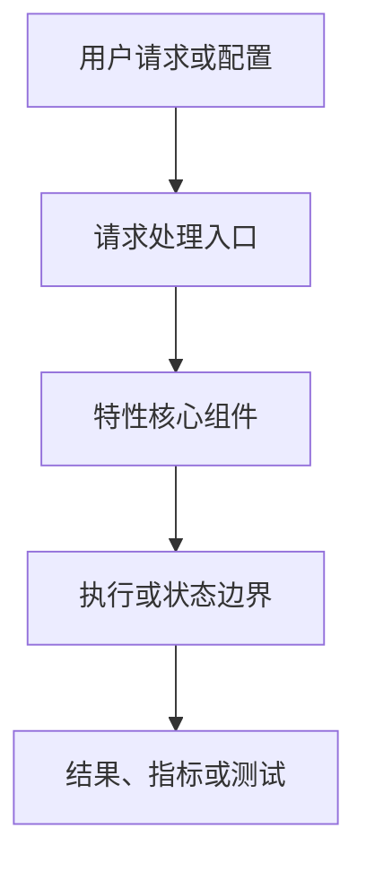
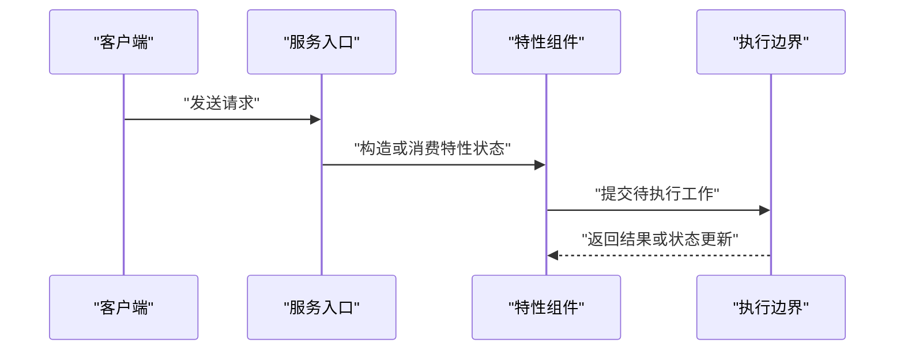

# SGLang 中文特性教程模板

按特性裁剪，不为空章节填充套话。所有“项目事实”必须可追溯至当前源码或官方文档。

```markdown
# SGLang <特性>：从设计到源码的入门导读

> **代码快照**：`OWNER/REPO@SHA`（branch）
> **面向读者**：<零基础 / 有 Python 基础 / 熟悉推理系统>
> **阅读目标**：<读完后能解释什么，并能从哪里继续读代码>

提交前替换所有 `<...>`。不要把“已核验”作为占位语：每个实现结论必须紧邻路径、符号和代码快照。

## 1. 先用三分钟理解它

### 它解决什么问题？

用一个具体请求或部署场景解释“没有它时的瓶颈”。列出适用边界、非目标和成本。

### 最小术语表

| 术语 | 一句话解释 | 与本特性的关系 |
|---|---|---|
| <中文（English）> | <通俗解释> | <作用> |

### 概念模型与实现事实

明确哪些是通用解释，哪些来自当前版本的文件、符号与测试。

## 2. 它位于 SGLang 的哪里？



图后用表格解释每个组件的职责、真实源码位置和是否属于 SGLang / kernel / 外部依赖。

## 3. 一次请求如何经过这个特性？



按顺序说明输入、输出、状态变化、关键不变量和对应符号。仅保留源码能证明的时序。

## 4. 源码阅读路线

| 顺序 | 位置与符号 | 为什么从这里读 | 输入/输出与不变量 | 下一跳 |
|---:|---|---|---|---|
| 1 | `path:Symbol` | <入口职责> | <输入、输出、状态变化或不变量> | <symbol> |

为最关键的 2–4 个点各给一段简短源码片段与解释。片段前注明 `path`、符号、commit；片段后解释它在调用链中的角色。

## 5. 设计权衡与边界

说明性能、显存/内存、并发、精度、兼容性或可观测性的真实权衡。实现未知时列“待确认问题”，不要猜测淘汰算法、同步策略或默认值。

## 6. 如何观察或亲手验证

| 目标 | 最小动作 | 预期观察 | 证据位置 |
|---|---|---|---|
| <路径是否走到特性> | <已验证配置或测试> | <日志、指标或断言> | `path` |

未执行命令须标注“未在当前环境运行”。NPU 验证标注所需芯片、CANN/torch-npu 版本和未验证的限制。

## 7. 下一步

- 先读：<最小入口>
- 再读：<核心状态或算法>
- 最后读：<测试、指标或 NPU 边界>

## 附录：代码位置索引与待确认项

| 组件 | 路径 / 符号 | 作用 | 证据类型 |
|---|---|---|---|
| <组件> | `path:Symbol` | <作用> | 源码 / 测试 / 文档 |
```
