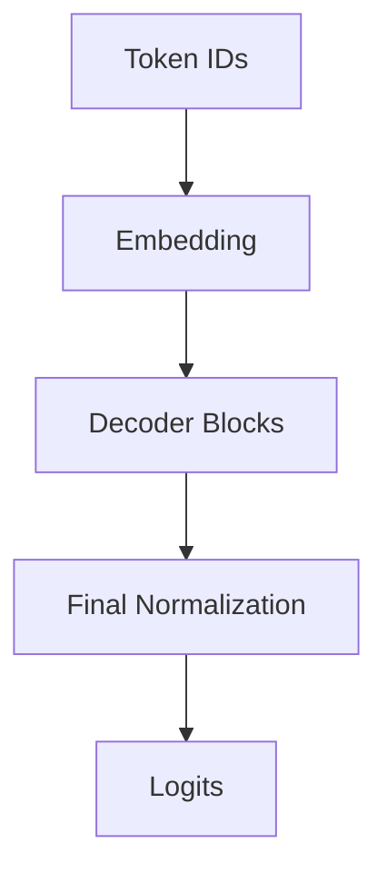
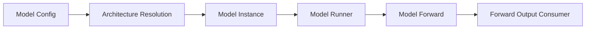
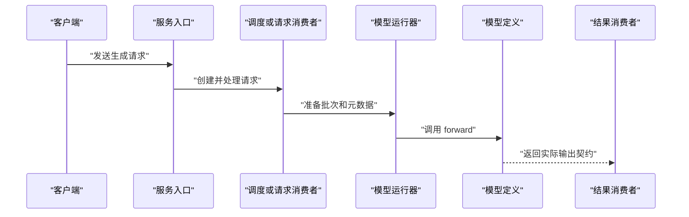

# SGLang 模型教程模板

根据模型变体裁剪；不要为空章节填充套话。提交前替换所有 `<...>`，每个 SGLang 实现结论必须紧邻路径、符号和源码快照。

```markdown
# SGLang 中的 <模型/变体>：模型结构与执行路径导读

> **模型范围**：<架构、checkpoint、量化或多模态变体>
> **代码快照**：`OWNER/REPO@SHA`（branch）
> **面向读者**：<基础水平>
> **阅读目标**：<可解释的设计与可继续阅读的源码入口>

## 1. 三分钟定位

说明模型解决的任务、为何要在 SGLang 中关注它，以及本教程覆盖/不覆盖的变体。先区分模型架构、权重 checkpoint 和运行时实现。

### 最小术语表

| 术语 | 通俗解释 | 在本模型或运行时中的作用 |
|---|---|---|
| <中文（English）> | <解释> | <作用> |

## 2. 模型结构：token 如何变成 logits

下图仅是 decoder-only 模型的概念骨架。用当前变体的 config 与源码替换、删除或补充节点；它本身不证明 final norm、输出头包装、权重共享或任何具体模块存在。



先解释通用数据流，再用表格映射当前变体的真实模块、配置字段、源码位置和证据。只展开本模型实际存在的 attention、MLP/MoE、norm、position encoding 或多模态组件。

## 3. 这份模型定义如何接入 SGLang



| 运行时阶段 | 已证实位置与符号 | 职责 | 输入/输出或不变量 |
|---|---|---|---|
| 架构解析 | `path:Symbol` | <如何选择模型定义> | <config/architecture 到类或工厂> |

## 4. 一次请求如何到达模型 forward



逐步说明真实参数、返回值消费者、状态变化及 prefill/decode 是否存在已证实的差异。

## 5. 源码阅读路线

| 顺序 | 位置与符号 | 为什么读 | 输入/输出与不变量 | 下一跳 | 证据 |
|---:|---|---|---|---|---|
| 1 | `path:Symbol` | <模型选择或加载入口> | <数据契约> | <symbol> | 源码/测试 |

为 2–4 个核心位置提供最小真实代码片段、路径、符号、commit 和解释。不要用伪代码替代项目实现。

## 6. 关键实现细节与边界

仅保留对指定变体有证据的权重映射、attention、MoE/VLM、positions、KV cache、量化或 NPU 内容；每节均标明适用变体和来源。实现不确定时列为待确认问题。

## 7. 如何观察与验证

| 目标 | 最小动作 | 预期观察 | 证据位置 |
|---|---|---|---|
| <模型类被选择> | <配置、单测或日志> | <可观察结果> | `path` |

未在当前环境执行的命令标注“未执行”。NPU 验证说明所需硬件和软件版本。

## 附录：代码索引与变体边界

| 组件 | 路径 / 符号 | 适用模型变体 | 证据类型 |
|---|---|---|---|
| <组件> | `path:Symbol` | <variant> | 源码 / 测试 / 官方文档 |
```
