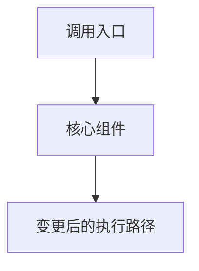

# SGLang PR Summary

Explain an SGLang PR so a reviewer can understand its intent, implementation, operational impact, and unresolved concerns without mistaking a diff for proof of behavior. Base every factual claim on the PR metadata, code changes, linked issues, tests, benchmarks, or discussion.

## Scope and input

Accept a PR number or GitHub URL. Default to `sgl-project/sglang`; use `sgl-project/sgl-kernel-npu` only when the user explicitly requests it. Use Simplified Chinese unless the user requests another language.

This is an analysis skill, not a review verdict and not a PR-description writer. Do not change code, post comments, open GitHub pages, or claim that a PR is ready to merge.

## Gather evidence

First identify the repository, PR number, default branch, and retrieval time. Prefer an authenticated `gh` CLI session; public GitHub API or the GitHub page are fallbacks. If data is unavailable because of access or rate limits, say which evidence could not be inspected.

```bash
gh pr view PR_NUMBER --repo OWNER/REPO \
  --json number,title,body,author,state,createdAt,updatedAt,mergedAt,closedAt,url,\
labels,assignees,reviewRequests,additions,deletions,changedFiles,baseRefName,headRefName,\
isDraft,milestone,comments,reviews

gh pr diff PR_NUMBER --repo OWNER/REPO
gh api --paginate repos/OWNER/REPO/pulls/PR_NUMBER/files
gh api --paginate repos/OWNER/REPO/pulls/PR_NUMBER/comments
gh api --paginate repos/OWNER/REPO/issues/PR_NUMBER/comments
gh pr checks PR_NUMBER --repo OWNER/REPO
```

When relevant, inspect linked issues, commits, changed tests, benchmark/profiling artifacts, and the current PR state after reading the diff. For a large PR, use the file list first, group files by module, and then read the patches for the changed execution path instead of treating every edited line as equally important.

Establish these facts before writing:

- The stated problem, intended user behavior, and linked issue context.
- The affected SGLang subsystem and the runtime path from public interface to implementation.
- New or changed APIs, configuration options, models, kernels, scheduler behavior, backends, or distributed paths.
- Tests, CI state, accuracy evidence, benchmark evidence, and their limitations.
- Material review discussion: design objections, requested changes, approvals, and unresolved threads.

Do not infer motivation from the diff alone. If the PR body and linked context do not establish why the change is needed, mark the motivation as unavailable rather than inventing it.

## Analyze SGLang-specific impact

Map changed files to the relevant areas where applicable:

- serving API, request lifecycle, tokenizer, scheduler, prefill/decode, KV cache, sampling, speculative decoding, disaggregation, or distributed execution;
- model implementation, attention backend, quantization, multimodal path, CUDA graph, or graph capture;
- CUDA, ROCm, Ascend/NPU, Triton, FlashInfer, DeepEP, NCCL/HCCL, or other backend-specific paths;
- tests, CI, documentation, configuration, and compatibility layers.

For inference-critical changes, distinguish evidence from hypotheses:

- **Correctness:** changed outputs, ordering, cache state, tensor shape/dtype, distributed synchronization, and fallback paths.
- **Performance:** throughput, TTFT, TPOT, ITL, memory, graph-capture hit rate, kernel time, communication overlap, or scheduling bubbles. Do not convert a code change into a performance claim without a comparable measurement.
- **Compatibility:** models, hardware, backend, precision, world size, configuration, and API behavior affected by the change.
- **Ascend impact:** identify whether the code path exists on NPU, whether CANN/torch-npu/AscendC or HCCL support is implicated, and whether the claimed behavior is verified on Ascend. Absence of NPU evidence means `未验证`, not `不支持`.

## Diagrams

Include one focused Mermaid diagram when it makes a changed interaction or execution path clearer. Do not create a diagram merely to satisfy a template.

- Use `flowchart TD` for request, scheduling, prefill/decode, fallback, or decision flow.
- Use `sequenceDiagram` for client/server, scheduler/worker, rank, or backend interactions.
- Use `graph LR` for module dependencies or data flow.
- Use `classDiagram` only for meaningful interface or class-hierarchy changes.

For PRs touching more than 20 files, diagram module-level relationships rather than individual functions. Diagram labels must be factual and match the selected report language.

## Report format

Return the report directly unless the user asks to save it. If saving is requested but no path is given, use `./outputs/sglang-pr-PR_NUMBER-summary.md`.

```markdown
# SGLang PR #<number>: <title>

> **作者**: @<author> | **状态**: <OPEN / MERGED / CLOSED / DRAFT> | **更新时间**: <date>
> **分支**: `<head>` → `<base>` | **标签**: <labels or 无>
> **变更规模**: +<additions> -<deletions>，涉及 <files> 个文件
> **数据截至**: <timestamp and timezone>

---

## 1. 总结

用 2–4 句说明 PR 解决的问题、核心方案和最重要的限制或待确认项。

## 2. 背景与动机

说明 PR 描述、关联 Issue 或讨论支持的动机。若没有可靠来源，明确写“PR 未提供可验证的动机说明”。

## 3. 代码修改分析

### 3.1 修改模块

| 模块 / 文件 | 操作 | 作用 |
|---|---|---|
| `path` | 新增 / 修改 / 删除 | 基于 diff 的简要说明 |

### 3.2 执行路径或架构图



仅在图确实有助于理解时保留本节；否则写明“不需要图：<原因>”。

### 3.3 关键实现细节

- <按组件解释关键改动、接口、状态流转或 fallback。>

## 4. 技术原理与运行时影响

解释理解该 PR 所需的概念，并明确它影响的请求路径、调度、模型、算子、缓存、并行或后端行为。只解释与本 PR 有关的原理。

## 5. 测试、准确性与性能证据

| 类别 | 已有证据 | 结论与限制 |
|---|---|---|
| CI / 单元测试 | <命令、检查或缺失> | <通过、失败、未运行或未知> |
| 准确性 | <结果或 N/A> | <覆盖范围与缺口> |
| 性能 / Profiling | <benchmark 或 N/A> | <硬件、负载、基线与限制> |
| Ascend / NPU | <测试或 N/A> | <已验证 / 未验证及原因> |

## 6. 评论区讨论亮点

- <仅记录有实质内容的 reviewer concern、设计演进、已解决或未解决问题。>
- 若未找到实质讨论，写“未发现需要特别关注的实质讨论”。

## 7. 风险与潜在问题

| 风险 | 严重程度 | 依据与影响 | 建议验证 |
|---|---|---|---|
| 正确性 / 性能 / 兼容性 / 测试 / 可维护性风险 | High / Medium / Low / Unknown | <事实或明确标注为推断> | <具体检查> |

## 8. 结论

用 1–2 句概括当前实现状态、已证实收益和主要未决项。不要把“未发现问题”表述为“没有问题”。

## 证据来源与局限

- [PR #<number>](<url>) — <读取时间>
- <相关 issue、commit、测试日志或 benchmark>
- <无法访问、diff 截断、未运行测试或其他局限>
```

## Writing rules

- 使用直接、技术性的中文；术语首次出现可保留英文括注。
- 区分“PR 明确说明”“代码显示”“测试证明”和“分析推断”。
- 只概括实质评论，跳过 `LGTM`、感谢、机器人通知和重复信息。
- 不捏造行号、测试结果、性能收益、硬件、版本、review 状态或合入准备度。
- 风险表只列与 diff、测试缺口或评论有关的风险；没有足够证据时使用 `Unknown`。
- 对 backend-specific 的改动，说明受影响和未受影响的后端；不把 CUDA 路径的结论直接外推到 AMD 或 Ascend。

## Related skill

当用户需要编写 SGLang PR 的提交说明，而不是分析既有 PR 时，使用 `sglang-pr-describer`；该技能使用社区的 `Motivation` 和 `Modifications` 模板。
